# 🤖 AI Agent with RAG - Assignment Solution

An intelligent AI agent with tool calling capabilities that combines Large Language Models with Retrieval-Augmented Generation (RAG) to intelligently route queries between direct answers and document-based retrieval.


## 🌐 Live Demo

**Deployed Application**: [https://asnmnt.onrender.com](https://asnmnt.onrender.com)

> ⏳ **Note**: First request may take ~50 seconds as the free tier instance spins up from sleep mode. Subsequent requests will be fast.

**GitHub Repository**: [https://github.com/asad1186/asnmnt](https://github.com/asad1186/asnmnt)

## 📋 Table of Contents

- [Architecture Overview](#architecture-overview)
- [Tech Stack](#tech-stack)
- [Features](#features)
- [System Flow](#system-flow)
- [Setup Instructions](#setup-instructions)
- [API Documentation](#api-documentation)
- [Design Decisions](#design-decisions)
- [Limitations & Future Improvements](#limitations--future-improvements)

## 🏗️ Architecture Overview

The system follows a modular architecture with the following components:

```
├── app/
│   ├── main.py           # FastAPI application
│   ├── agent.py          # Core AI Agent logic
│   ├── llm_client.py     # OpenAI API wrapper
│   ├── memory.py         # Session-based conversation memory
│   ├── tools.py          # RAG tool implementation
│   ├── rag.py            # Document processing & vector store
│   ├── prompts.py        # System prompts
│   └── schemas.py        # Pydantic models
├── data/
│   └── documents/        # PDF documents for RAG
└── embeddings/           # FAISS vector store
```

## 🛠️ Tech Stack

### Core Technologies
- **Python 3.10+**
- **FastAPI** - High-performance web framework
- **OpenAI API** - LLM (GPT-4o-mini) and Embeddings (text-embedding-3-large)
- **LangChain** - Document processing and RAG pipeline
- **FAISS** - Vector similarity search

### Key Libraries
- `langchain-community` - Document loaders and vector stores
- `langchain-openai` - OpenAI integrations
- `pypdf` - PDF document parsing
- `python-dotenv` - Environment variable management

### Deployment
- **Render** - Cloud hosting platform (Azure alternative)

> **Note**: Originally planned for Azure deployment, but due to Azure free trial limitations, the application is deployed on Render, which provides similar cloud hosting capabilities with free tier availability.

## ✨ Features

### ✅ Completed Requirements

#### Task 1: AI Agent Development
- ✅ Accepts user queries via API
- ✅ Intelligent decision-making (direct LLM vs tool-based)
- ✅ Prompt engineering for decision and answer generation
- ✅ Tool calling implementation (RAG tool)
- ✅ Session-based memory management

#### Task 2: RAG Implementation
- ✅ 3 sample PDF documents included
- ✅ Document-to-embedding conversion
- ✅ FAISS vector store for efficient retrieval
- ✅ Relevant chunk retrieval with similarity search
- ✅ Context-aware LLM responses

#### Task 3: Backend API
- ✅ FastAPI framework
- ✅ POST `/ask` endpoint
- ✅ Proper request/response schemas
- ✅ Session ID support for conversation continuity

#### Task 4: Deployment
- ✅ Deployed on Render (Azure alternative)
- ✅ Environment variable configuration
- ✅ Publicly accessible URL

#### Task 5: Documentation
- ✅ Comprehensive README
- ✅ Architecture diagram with flowchart
- ✅ Setup instructions
- ✅ Design decisions explained
- ✅ Limitations and improvements documented

## 🔄 System Flow

```mermaid
graph TD
    Start([👤 User Query]) --> FastAPI[🚀 FastAPI /ask Endpoint]
    FastAPI --> Agent[🤖 AIAgent.decide_and_answer]
    
    Agent --> Decision{🧠 LLM Decision<br/>Tool or Direct?}
    
    Decision -->|"📝 decision = 'direct'"| DirectLLM[💬 Direct LLM Response]
    Decision -->|"🔧 decision = 'tool'"| RAG[📚 RAG Tool: retrieve_docs]
    
    RAG --> LoadFAISS[🗄️ Load/Build FAISS Index]
    LoadFAISS --> CheckIndex{📦 Index Exists?}
    
    CheckIndex -->|❌ No| BuildIndex[🔨 Build FAISS Index]
    BuildIndex --> LoadPDF[📄 Load PDFs from data/documents]
    LoadPDF --> SplitDocs[✂️ Split Documents<br/>chunk_size=500<br/>overlap=100]
    SplitDocs --> CreateEmbed[🔢 Create Embeddings<br/>text-embedding-3-large]
    CreateEmbed --> SaveFAISS[💾 Save FAISS to embeddings/]
    SaveFAISS --> SearchVec
    
    CheckIndex -->|✅ Yes| SearchVec[🔍 Similarity Search<br/>k=3]
    
    SearchVec --> ExtractContext[📋 Extract Context & Sources]
    ExtractContext --> BuildPrompt[📝 Build Prompt with Context]
    BuildPrompt --> FinalLLM[🤖 LLM Final Answer<br/>with Context]
    
    DirectLLM --> SaveMemory[💾 Save to Session Memory]
    FinalLLM --> SaveMemory
    
    SaveMemory --> Response[📤 Return AskResponse]
    Response --> End([✨ Answer + Sources])
    
    style Start fill:#e1f5ff
    style End fill:#d4edda
    style Decision fill:#fff3cd
    style CheckIndex fill:#fff3cd
    style RAG fill:#f8d7da
    style FinalLLM fill:#d1ecf1
    style DirectLLM fill:#d1ecf1
```



### Flow Explanation

1. **User Query**: User sends a query to the FastAPI `/ask` endpoint
2. **Decision Phase**: LLM analyzes the query and decides:
   - **Direct**: Answer using general knowledge
   - **Tool**: Fetch information from documents
3. **RAG Path** (if tool selected):
   - Load or build FAISS vector index from PDFs
   - Perform similarity search (k=3 chunks)
   - Extract context and source documents
   - Generate answer with retrieved context
4. **Direct Path**: Generate answer using LLM's knowledge
5. **Memory**: Store conversation in session memory
6. **Response**: Return structured response with answer and sources

## 📦 Setup Instructions

### Local Development

1. **Clone the repository**
```bash
git clone https://github.com/asad1186/asnmnt.git
cd asnmnt
```

2. **Create virtual environment**
```bash
python -m venv venv
source venv/bin/activate  # On Windows: venv\Scripts\activate
```

3. **Install dependencies**
```bash
pip install -r requirements.txt
```

4. **Set up environment variables**

Create a `.env` file in the root directory:
```env
OPENAI_API_KEY=your_openai_api_key_here
```

5. **Add documents**

Place your PDF documents in the `data/documents/` directory.

6. **Build FAISS index** (optional - will auto-build on first query)
```bash
python -c "from app.rag import build_faiss; build_faiss()"
```

7. **Run the application**
```bash
uvicorn app.main:app --reload
```

The API will be available at `http://localhost:8000`

### API Documentation

Once running, visit:
- Swagger UI: `http://localhost:8000/docs`
- ReDoc: `http://localhost:8000/redoc`

## 📡 API Documentation

### POST `/ask`

Ask a question to the AI agent.

**Request Body:**
```json
{
  "query": "What is the company's remote work policy?",
  "session_id": "user123"
}
```

**Parameters:**
- `query` (string, required): The user's question
- `session_id` (string, optional): Session identifier for conversation continuity

**Response:**
```json
{
  "answer": "According to the company policy, employees can work remotely up to 3 days per week...",
  "sources": ["remote_work_policy.pdf", "employee_handbook.pdf"]
}
```

**Fields:**
- `answer` (string): The AI-generated response
- `sources` (array): List of source documents used (empty if direct LLM response)

### Example cURL Request

```bash
curl -X POST "https://asnmnt.onrender.com/ask" \
  -H "Content-Type: application/json" \
  -d '{
    "query": "What are the vacation policies?",
    "session_id": "demo-session"
  }'
```

## 🎯 Design Decisions

### 1. **Two-Stage Decision Making**
The agent uses a dedicated decision prompt to classify queries before answering. This approach:
- Reduces unnecessary RAG calls for general questions
- Improves response time for non-document queries
- Allows better control over tool usage

### 2. **FAISS for Vector Storage**
Chosen for:
- Fast similarity search
- No external dependencies (unlike Pinecone)
- Easy local development and debugging
- Lightweight and efficient for moderate document volumes

### 3. **Session-Based Memory**
Implemented in-memory dictionary storage:
- Simple and fast for development
- Sufficient for proof-of-concept
- Easy to extend to persistent storage

### 4. **Chunk Strategy**
- **Chunk size**: 500 characters
- **Overlap**: 100 characters
- **Reasoning**: Balances context preservation with retrieval precision

### 5. **OpenAI Models**
- **LLM**: `gpt-4o-mini` - Cost-effective with good performance
- **Embeddings**: `text-embedding-3-large` - High-quality semantic search

### 6. **Render Deployment**
Used Render instead of Azure due to:
- Azure free trial limitations
- Render's generous free tier
- Simpler deployment process
- Similar cloud hosting capabilities

## ⚠️ Limitations & Future Improvements

### Current Limitations

#### 1. **No Standalone Question Generation**
**Issue**: The system doesn't reformulate queries based on conversation history before querying the vector database.

**Impact**: 
- Follow-up questions like "What about sick leave?" (after asking about vacation) may not retrieve relevant context
- The retrieval is based on the exact user query, not the conversation context

**Example**:
```
User: "What's the vacation policy?"
Agent: [Retrieves and answers correctly]
User: "What about sick leave?"
Agent: [May not retrieve correctly without "sick leave policy" context]
```

#### 2. **Prompt Engineering Opportunities**
**Current State**: Basic prompts for decision-making and answering

**Improvements Needed**:
- Add document schema information to decision prompt
- Include examples of query types that require tool usage
- Better context about available document types
- Few-shot examples for edge cases

**Example Enhancement**:
```python
decision_prompt = """
You have access to company documents including:
- HR policies (vacation, sick leave, remote work)
- Technical documentation
- Product FAQs

Examples:
- "What's the capital of France?" -> DIRECT (general knowledge)
- "How many vacation days do I get?" -> TOOL (company policy)
- "What is Python?" -> DIRECT (general knowledge)
...
"""
```

#### 3. **In-Memory Session Storage**
**Issue**: Session history is lost when the application restarts

**Impact**:
- No conversation persistence across deployments
- Memory loss during server restarts
- Not suitable for production use

#### 4. **Limited Context Window**
**Current**: Retrieves top 3 chunks (k=3)

**Issue**: May miss relevant information spread across multiple sections

#### 5. **No Query Understanding**
- Cannot handle multi-part questions
- No query decomposition for complex queries
- Limited handling of ambiguous questions

### 🚀 Proposed Future Improvements

#### High Priority

1. **Conversational Query Reformulation**
```python
def reformulate_query(query: str, history: list) -> str:
    """Convert follow-up questions to standalone queries"""
    # Use LLM to reformulate based on context
    # Example: "What about sick leave?" -> "What is the company sick leave policy?"
    pass
```

2. **Persistent Storage with SQLite**
```python
# Benefits:
# - Conversation history survives restarts
# - Fast local database
# - No external dependencies
# - Easy to backup and migrate
# - ACID compliance for data integrity

import sqlite3

class PersistentMemory:
    def __init__(self, db_path="sessions.db"):
        self.conn = sqlite3.connect(db_path)
        self.create_tables()
    
    def create_tables(self):
        self.conn.execute("""
            CREATE TABLE IF NOT EXISTS conversations (
                id INTEGER PRIMARY KEY,
                session_id TEXT,
                role TEXT,
                content TEXT,
                timestamp DATETIME DEFAULT CURRENT_TIMESTAMP
            )
        """)
```

3. **Enhanced Decision Prompt**
- Add document catalog/schema
- Include few-shot examples
- Specify decision criteria more clearly

#### Medium Priority

4. **Query Classification**
- Detect question type (factual, procedural, comparison)
- Route to specialized prompts

5. **Caching Layer**
- Cache frequent queries
- Reduce API calls and latency

#### Low Priority (Production Features)

6. **Monitoring & Logging**
- Azure Monitor equivalent on Render
- Query analytics
- Error tracking
- Performance metrics

7. **Docker Containerization**
```dockerfile
FROM python:3.10-slim
WORKDIR /app
COPY requirements.txt .
RUN pip install -r requirements.txt
COPY . .
CMD ["uvicorn", "app.main:app", "--host", "0.0.0.0", "--port", "8000"]
```

8. **Rate Limiting & Authentication**
- API key management
- Request throttling
- User authentication

9. **Document Management API**
- Upload new documents
- Update FAISS index dynamically

10. **Multi-Language Support**
- Document translation
- Query language detection
- Cross-lingual retrieval

## 🔧 Environment Variables

Required environment variables:

```env
# OpenAI Configuration
OPENAI_API_KEY=your_openai_api_key

# Optional
OPENAI_MODEL=gpt-4o-mini
EMBEDDING_MODEL=text-embedding-3-large
```

## 📄 License

This project is created for assignment purposes.

## 👤 Author

**Asad**
- GitHub: [@asad1186](https://github.com/asad1186)
- Deployment: [asnmnt.onrender.com](https://asnmnt.onrender.com)

## 🙏 Acknowledgments

- OpenAI for LLM and embedding models
- LangChain for RAG framework
- FastAPI for the excellent web framework
- Render for hosting

---

**Note**: This application was developed as part of an AI Agent assignment. While it demonstrates core concepts of agent development, RAG, and API design, production deployment would require additional features like authentication, monitoring, and persistent storage.